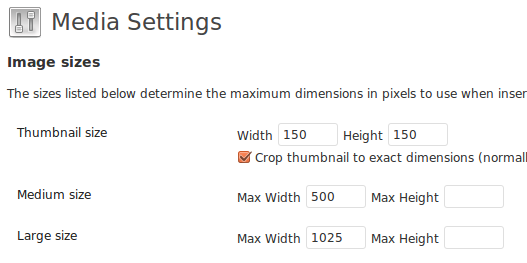

# wp-theme-ueberdesign

## Disclaimer

This is a Wordpress theme in an open repository. Feel free to look around and use parts of this theme or all of it. But be aware, that this theme was created for our personal use and it is not intended to work on every possible installation in the world.

## Installation

1. Dowload the files, (extract them,) and copy them to `[your-wordpress-installation]/wp-content/themes/'
2. Log in to Wordpress, go to `Appearance` > `Themes`, and select this one.

## Important settings

### Media settings

**Do this before you start uploading images**

Go to `Settings` > `Media` and choose the following image sizes:

* **Medium size**: Max Width = 500
* **Large size**: Max Width = 1025

### Menü

1. Go to `Settings` > `Menu`
2. Create a new Menu, save it.
3. Look out for the box `Theme Location` and map your new menu to `Primary`. Save it

**Hint**:
If you want to add a «Home» link (and name it i.e. «Selected Work»), look out for the box `Pages`, click on the tab `View all` and choose `Home:Home`.

## About shortcodes in the content area

### Small Margin Box
* Type `[SmallMarginBoxStart]` to open a «Small Margin Box», which restrain the contents inside the box to 750px (instead of the full width of 1025px).
* Type `[SmallMarginBoxEnd]` to close the box.

### Huge Margin Box
* Type `[HugeMarginBoxStart]` to open a «Huge Margin Box», which restrain the contents inside the box to ~ 500px (instead of the full width of 1025px).
* Type `[HugeMarginBoxEnd]` to close the box.

### ShareBox (only feasible within a Huge Margin Box)
* Type `[ShareBox]` between Start and End of the HugeMarginBox to display share links at the right side of the Huge Margin Bix

## When to use &lt;p&gt; (Paragraph) and when &lt;h3&gt; (Heading 3)
* In the Hugemargin-Box, the Paragraph makes a margin at the bottom, the h3 not
